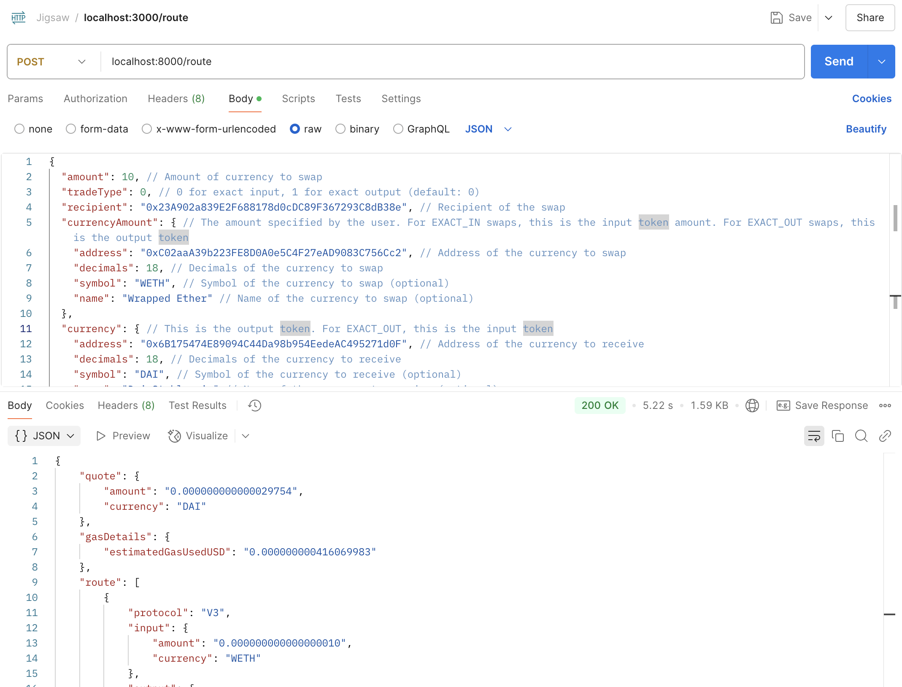

# Uniswap Smart Router as a Service

This service provides an API for finding the best prices for swaps between two tokens on the Uniswap protocol. It
leverages the [Uniswap Smart Order Router](https://github.com/Uniswap/smart-order-router) to calculate optimal routes
and execute swaps efficiently.

---

## Features

- Get the best price for token swaps on Uniswap.
- Support for exact input (EXACT_IN) and exact output (EXACT_OUT) trades.
- Provides pre-encoded calldata for direct transaction execution.
- Includes gas and price adjustments in the response.
- Supports slippage tolerance and custom deadlines.

---

## Installation

### Prerequisites

- Node.js (v14 or higher).
- npm package manager.

### Steps

1. Clone the repository:
   ```bash
   git clone <repository_url>
   cd <repository_folder>
   ```

2. Install dependencies:
   ```bash
   npm install
   ```

3. Create a `.env` file with the following variables:
   ```env
   PORT=8000  # Port to run the server on
   CHAIN_ID=1  # Chain ID of the network to connect to
   JSON_RPC_URL="https://mainnet.infura.io/v3/<api_key>"  # JSON RPC URL of the network (e.g., Infura)
   ```

4. Run the server:
    - For development:
      ```bash
      npm run dev
      ```
    - For production (build first):
      ```bash
      npm run build
      npm start
      ```

### Docker

To run the service using Docker:

1. Build the Docker image:
   ```bash
   docker build -t uniswap-router-service .
   ```

2. Run the Docker container:
   ```bash
   docker run -d --name uniswap-router-service -p 8000:8000 --env-file .env uniswap-router-service
   ```

---

## API Documentation

### Endpoint: `POST /route`

This endpoint calculates the optimal swap route for a trade.

Example in Postman:



#### Request Body

```json
{
  "amount": 200,
  "tradeType": 0,
  "recipient": "0x23A902a839E2F688178d0cDC89F367293C8dB38e",
  "currencyAmount": {
    "address": "0xC02aaA39b223FE8D0A0e5C4F27eAD9083C756Cc2",
    "decimals": 18,
    "symbol": "WETH",
    "name": "Wrapped Ether"
  },
  "currency": {
    "address": "0x6B175474E89094C44Da98b954EedeAC495271d0F",
    "decimals": 18,
    "symbol": "DAI",
    "name": "Dai Stablecoin"
  }
}
```

#### Parameters

- **amount** (number): The amount of currency to swap.
- **tradeType** (number):
    - `0`: Exact input (EXACT_IN).
    - `1`: Exact output (EXACT_OUT).
- **recipient** (string): The recipient address for the output token.
- **currencyAmount** (object):
    - `address` (string): Address of the input token.
    - `decimals` (number): Decimals of the input token.
    - `symbol` (string): (Optional) Symbol of the input token.
    - `name` (string): (Optional) Name of the input token.
- **currency** (object):
    - `address` (string): Address of the output token.
    - `decimals` (number): Decimals of the output token.
    - `symbol` (string): (Optional) Symbol of the output token.
    - `name` (string): (Optional) Name of the output token.

#### Example Request

```json
{
  "amount": 100,
  "tradeType": 0,
  "recipient": "0x23A902a839E2F688178d0cDC89F367293C8dB38e",
  "currencyAmount": {
    "address": "0xC02aaA39b223FE8D0A0e5C4F27eAD9083C756Cc2",
    "decimals": 18,
    "symbol": "WETH",
    "name": "Wrapped Ether"
  },
  "currency": {
    "address": "0x6B175474E89094C44Da98b954EedeAC495271d0F",
    "decimals": 18,
    "symbol": "DAI",
    "name": "Dai Stablecoin"
  }
}
```

#### Example Response

```json
{
  "quote": {
    "amount": "0.000000000000029754",
    "currency": "DAI"
  },
  "gasDetails": {
    "estimatedGasUsedUSD": "0.000000000416069983"
  },
  "route": [
    {
      "protocol": "V3",
      "input": {
        "amount": "0.000000000000000010",
        "currency": "WETH"
      },
      "output": {
        "amount": "0.000000000000029754",
        "currency": "DAI"
      }
    }
  ],
  "methodParameters": {
    "calldata": "0x5ae401dc00000000000000000000000000000000000000000000000000000000678f89e1...",
    "value": "0x00",
    "to": "0x68b3465833fb72A70ecDF485E0e4C7bD8665Fc45"
  },
  "blockNumber": null,
  "hitsCachedRoute": false
}
```

#### Response Fields

- **quote**: The quote for the trade.
    - `amount`: Amount of the output token.
    - `currency`: Symbol of the output token.
- **gasDetails**:
    - `estimatedGasUsedUSD`: Estimated gas cost in USD.
- **route**: Details about the trade route.
    - `protocol`: The protocol used for the swap (e.g., V3).
    - `input`: Input token details.
        - `amount`: Amount of input token.
        - `currency`: Symbol of the input token.
    - `output`: Output token details.
        - `amount`: Amount of output token.
        - `currency`: Symbol of the output token.
- **methodParameters**:
    - `calldata`: Pre-encoded calldata for executing the swap.
    - `value`: ETH value sent with the transaction (if any).
    - `to`: Address of the contract to execute the swap.
- **blockNumber**: Block number when the quote was generated.
- **hitsCachedRoute**: Indicates if a cached route was used.

---

## Example Use Case

### Objective

Swap 1 WETH for the maximum amount of DAI, ensuring a slippage tolerance of 0.5%.

### Request Body

```json
{
  "amount": 1,
  "tradeType": 0,
  "recipient": "0xYourWalletAddress",
  "currencyAmount": {
    "address": "0xC02aaA39b223FE8D0A0e5C4F27eAD9083C756Cc2",
    "decimals": 18,
    "symbol": "WETH",
    "name": "Wrapped Ether"
  },
  "currency": {
    "address": "0x6B175474E89094C44Da98b954EedeAC495271d0F",
    "decimals": 18,
    "symbol": "DAI",
    "name": "Dai Stablecoin"
  }
}
```

---

## Development Notes

### Technologies Used

- **Node.js**: Backend runtime.
- **Express.js**: Web framework for handling API requests.
- **Uniswap Smart Order Router**: For route calculation.
- **Ethers.js**: For handling Ethereum interactions.
- **dotenv**: For environment variable management.
- **Cors**: For cross-origin request handling.

### Key Files

- `src/app.ts`: Main application logic.
- `src/utils.ts`: Helper functions, including token parsing and response formatting.

---

## License

This project is licensed under the MIT License. See the LICENSE file for details.

